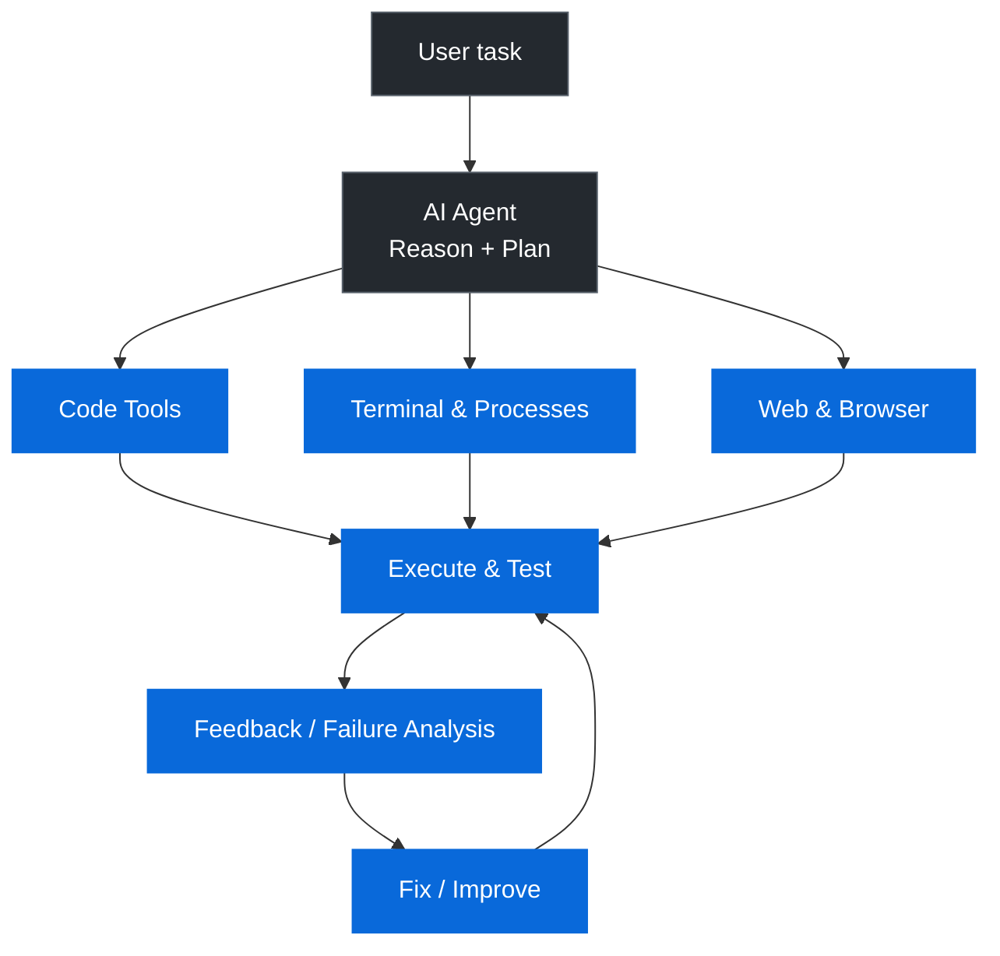
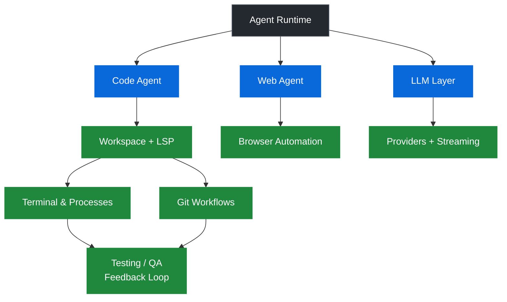

# 🤖 Advanced AI Coding Agent

> **An autonomous software-engineering agent built to work with real codebases — not just generate code.**

[](https://www.python.org/)
[](https://git-scm.com/)
[](https://www.docker.com/)
[](https://github.com/KigenIsaac/advanced-ai-agent/actions/workflows/ci.yml)

**AI Agent · Developer Tooling · Code Intelligence · Automation**

## 🚀 Quick Start

### Requirements

- Python 3.x (CI currently validates Python 3.12)
- An API key for the selected LLM provider
- Docker is optional and only needed for the Docker sandbox backend
- Playwright browser binaries are required for browser automation

### Install

Linux / macOS:

```bash
git clone https://github.com/KigenIsaac/advanced-ai-agent.git
cd advanced-ai-agent

python -m venv .venv
source .venv/bin/activate

python -m pip install --upgrade pip
python -m pip install -r requirements.txt
python -m playwright install
```

Windows PowerShell:

```powershell
git clone https://github.com/KigenIsaac/advanced-ai-agent.git
cd advanced-ai-agent

py -m venv .venv
.\.venv\Scripts\Activate.ps1

py -m pip install --upgrade pip
py -m pip install -r requirements.txt
py -m playwright install
```

### Configure

Copy `.env.example` to `.env` and provide your API key:

```text
AGNES_API_KEY=your_api_key_here
AGNES_PROVIDER=agnes
AGNES_MODEL=agnes-3.0-flash
```

The repository ignores `.env` so credentials should not be committed.

### Run

```bash
python main.py
```

On Windows, `py main.py` can be used instead.

The CLI lets you select a provider and open or create a project workspace. Use `--help` to inspect available runtime options.

### Run tests

Install development dependencies:

```bash
python -m pip install -r requirements-dev.txt
pytest -q
```

On Windows:

```powershell
py -m pip install -r requirements-dev.txt
py -m pytest -q
```

The test suite covers configuration behavior plus deterministic workspace, test-runner, failure-parsing, and provider-utility components. No API key is required to run the tests.

---

## Overview

Most LLM applications stop at producing text or code suggestions.

This project explores a different approach:



The goal is to give an AI the tools required to **inspect, change, execute, test, debug, and manage software-engineering work**.

---

## ✨ Core Capabilities

### 🧠 Codebase Intelligence

The agent can work with existing projects instead of assuming that it is starting from an empty directory.

Capabilities include:

- Project structure inspection
- File and directory operations
- Search and grep
- Regular-expression search
- Symbol discovery
- Functions and classes
- Imports and exports
- Dependency inspection
- AST-based code inspection
- Module relationships
- LSP-powered code intelligence
- Project context and engineering conventions

---

### ✏️ Code Editing & Refactoring

The agent provides structured ways to modify software:

- Create files
- Read files
- Edit files
- Append content
- Delete files
- Move and copy files
- Apply patches
- Preview changes
- Replace ranges
- Insert and delete code
- Rewrite files
- Rename symbols
- Manage imports
- Extract or inline code
- Split files
- Simplify code
- Remove dead code
- Track and revert edit history

The emphasis is on **controlled software modification**, rather than blindly overwriting files.

---

### 🖥️ Terminal & Process Execution

The agent can interact with the development environment through process tooling.

It supports:

- Foreground processes
- Background processes
- Process inspection
- Process termination
- Waiting for processes
- Execution timeouts
- stdout/stderr capture
- Environment handling
- Unix process groups
- Cross-platform execution

This allows the agent to move from:

```text
"Here is some code."
```

to:

```text
"Here is the code → I executed it → observed the result → diagnosed the failure → changed it → tested it again."
```

---

## 🧪 Testing & Quality

The project includes tooling for discovering and executing tests across multiple ecosystems.

Supported test tooling includes detection/execution for:

- pytest
- unittest
- Jest
- Vitest
- Mocha
- Cargo
- Go

It also provides capabilities for:

- Test discovery
- Individual test execution
- Failure extraction
- Coverage information
- Test scaffolding
- Static analysis
- Security scanning
- Complexity analysis
- Dead-code hints

Static/security tooling includes integrations for tools such as:

- Ruff
- Flake8
- Pylint
- ESLint
- Clippy
- `go vet`
- Bandit
- Semgrep
- Trivy
- Radon
- Lizard

---

## 🔀 Git & Software Workflows

The agent can interact with Git-based development workflows.

Capabilities include:

- Repository status
- Diffs
- Commit history
- Commit inspection
- Branch management
- Add/commit
- Amend
- Stash
- Revert
- Reset
- Merge
- Rebase
- Cherry-pick
- Blame/history
- Pull/push
- Pull request creation and updates

This makes Git part of the agent's working environment rather than an external manual step.

---

## 🌐 Browser & Web Agent

The project also includes browser automation and web-research capabilities.

The browser layer supports workflows such as:

- Navigation
- Clicking
- Typing
- Forms
- Scrolling
- Selection
- Uploads
- JavaScript execution
- Screenshots
- Tabs
- Frames
- Network inspection
- Downloads
- Cookies
- Local storage
- Accessibility trees
- Semantic snapshots
- Element discovery
- Challenge detection
- Navigation recovery

The system can also perform web, news, image, and shopping research.

---

## 🧩 LSP & Code Intelligence

Language Server Protocol capabilities allow the agent to reason about code at a deeper level than plain text search.

Supported operations include:

- Definitions
- References
- Hover information
- Rename
- Document symbols
- Workspace symbols
- Diagnostics

This provides a foundation for more reliable code navigation and refactoring.

---

## 🤖 Multi-Provider LLM Architecture

The project uses a provider abstraction so the agent is not tied to a single model vendor.

The provider layer supports integrations across multiple providers and local/model-routing environments, including:

- OpenAI
- Anthropic
- Gemini
- DeepSeek
- Groq
- Mistral
- Together
- Cohere
- Perplexity
- Fireworks
- xAI
- OpenRouter
- Ollama
- Agnes
- Local providers

The provider layer also addresses practical production concerns such as:

- Retries
- Transient network failures
- Rate limits
- `Retry-After`
- Multiple API keys
- Provider/key cooldowns
- Streaming
- Malformed responses
- Tool-call argument normalization
- Conversation-history repair

---

## 🧠 Persistent Project Context

Long-running software tasks require more than a single prompt.

The agent can maintain project-level context including:

- Project information
- Architecture
- Engineering conventions
- Recent changes
- Repository documentation

It can inspect project guidance files such as:

```text
AGENTS.md
CLAUDE.md
.cursorrules
CONTRIBUTING.md
README.md
```

This allows the agent to adapt its behavior to the project it is working on.

---

## 🔐 Sandboxed Execution

The project includes execution backends designed to separate agent-controlled work from the host environment.

### Subprocess backend

Useful for local development and direct execution.

### Docker backend

Provides containerized execution with the workspace mounted into the container.

> **Security note:** this is an engineering sandbox, not a claim of a hardened security boundary. Untrusted workloads should be isolated further and run with appropriate resource, network, filesystem, and privilege restrictions.

---

## 🚀 Deployment & Monitoring

The deployment layer contains workflows for detecting and interacting with common deployment environments, including:

- Vercel
- Netlify
- Fly.io
- Render
- Docker
- GitHub Actions
- Heroku
- Kubernetes

It also provides hooks for:

- Deployment
- Deployment status
- Logs
- Rollback
- Health monitoring
- Metrics

Destructive deployment actions can be gated behind explicit authorization.

---

## 🏗️ Architecture

At a high level, the project is organized around several cooperating subsystems:



---

## 📁 Repository Structure

```text
.
├── codeagent/
│   ├── sandbox.py
│   ├── deploy.py
│   ├── testing.py
│   └── ...
├── llm_providers/
├── webagent/
├── main.py
├── providers.json
├── requirements.txt
├── requirements-dev.txt
├── .env.example
├── .github/workflows/ci.yml
├── test_custom_agent_config.py
└── test_core_components.py
```

The repository is intentionally modular around the major capabilities required by an autonomous software-engineering workflow.

---

## 🎯 Example Workflow

A typical agent task can follow a loop like:

```text
1. Understand the task
2. Inspect the repository
3. Identify relevant files
4. Inspect dependencies and architecture
5. Plan the change
6. Modify the code
7. Run tests
8. Analyze failures
9. Apply fixes
10. Re-run validation
11. Inspect the final diff
12. Commit or prepare the change
```

The important part is the **feedback loop**.

The agent is not considered successful merely because it generated code. It should be able to observe what happened after execution and respond to the result.

---

## 🧪 Project Philosophy

This project explores a broader direction for AI-assisted software engineering:

```text
LLM
 │
 ├── Understand
 │
 ├── Plan
 │
 ├── Use tools
 │
 ├── Execute
 │
 ├── Observe
 │
 ├── Test
 │
 ├── Diagnose
 │
 └── Improve
```

The objective is to move from **AI that writes code** toward **AI that can participate in the software-engineering process**.

---

## ⚠️ Engineering Considerations

This is an advanced experimental system and should not be treated as a universally safe autonomous production agent.

Important considerations include:

- Agent-generated code must be reviewed.
- Subprocess execution is not equivalent to secure isolation.
- Docker configurations should be hardened for untrusted workloads.
- Browser automation can interact with external systems and should be permissioned appropriately.
- Deployment actions should be protected by explicit authorization.
- Credentials and API keys must never be committed to the repository.
- Network access and filesystem permissions should be restricted when running untrusted tasks.

---

## 🛠️ Technology

**Language:** Python

**Core areas:**

- LLM orchestration
- Tool calling
- Code intelligence
- LSP
- AST inspection
- Terminal/process execution
- Testing
- Static analysis
- Security scanning
- Git automation
- Browser automation
- Docker execution
- Deployment workflows
- Multi-provider AI

---

## 📌 Why This Project Exists

Software engineering involves much more than generating source code.

A real engineering task can require:

```text
Understand the system
        ↓
Find the right files
        ↓
Change the implementation
        ↓
Run the software
        ↓
Observe failures
        ↓
Debug
        ↓
Test
        ↓
Review the diff
        ↓
Deliver
```

This project is an exploration of what happens when an AI system is given the tools required to participate in that complete loop.

---

## 👤 Author

**Isaac Kigen**

Software Developer focused on:

- AI agent engineering
- LLM applications
- Backend systems
- Developer tools
- Automation
- Real-time AI

---

## ⭐ Status

This project is actively evolving as an exploration of autonomous software-engineering systems.
